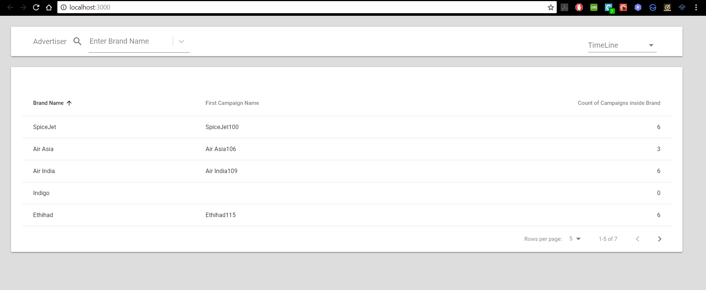
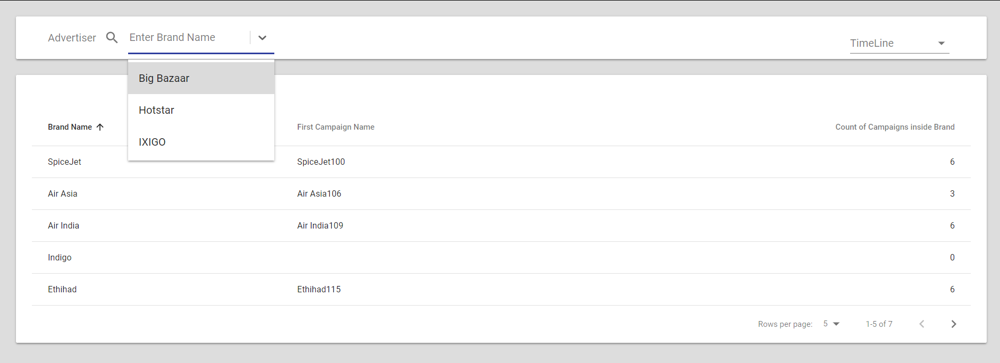
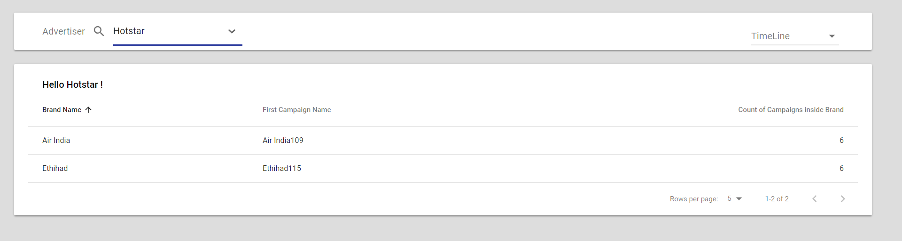
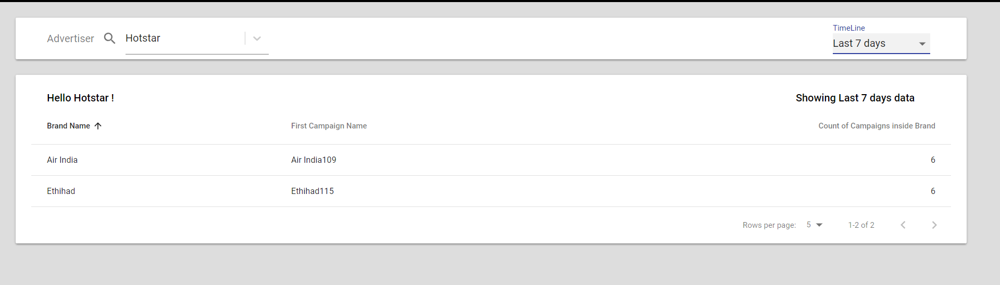

## Quick Overview

Make sure to have nodejs > 8 installed

```sh
cd zeotap
npm install
npm start
```

This starts up the app and can be viewed on http://localhost:3000/ 

Initial Screen:

<p align='center'>

</p>


## Brief Explanation of Code

* This application is setup with reactjs and themed in react material UI
* The layout of page is mainly setup in src/components/Home.js on default route
* The Toolbar Component provides the search filtering and selection options
* The BodyArea component displays table of fetched data
* The data is fetched from server with fetch API and initial state and data of application is then set
* Now the data is loaded into the table component 

* To search any Advertiser Name, Use the searchbox to filter table results
<p align='center'>

</p>

* On Searching and Selection of any option, the table results are filtered and Hi {advertiserName} ! is displayed
<p align='center'>

</p>

* On Selection of timeline option on left, the appropriate message is shown
<p align='center'>

</p>

* The table is paginated and by default 5 rows are displayed per page and this can be increased 
  
* Use left and right icons of table to naviagate across pages 

